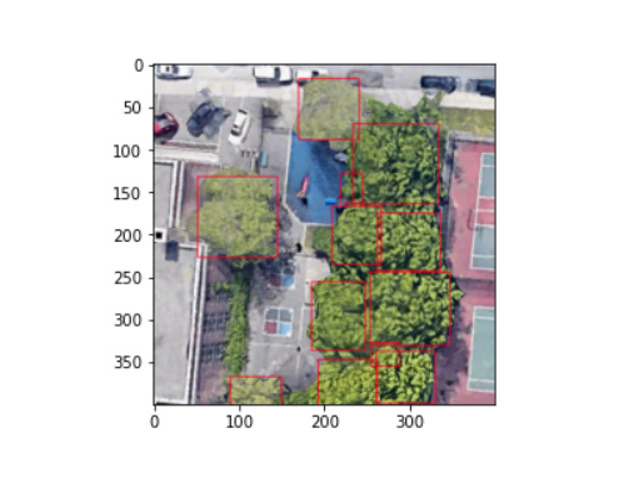

# DeepForest

[](https://travis-ci.org/weecology/DeepForest)
[](http://deepforest.readthedocs.io/en/latest/?badge=latest)
[](https://pypi.python.org/pypi/DeepForest)
[](https://doi.org/10.5281/zenodo.2538143)


### Conda build status

| Name | Downloads | Version | Platforms |
| --- | --- | --- | --- |
| [](https://anaconda.org/conda-forge/deepforest) | [](https://anaconda.org/conda-forge/deepforest) | [](https://anaconda.org/conda-forge/deepforest) | [](https://anaconda.org/conda-forge/deepforest) |

DeepForest is a python package for training and predicting individual tree crowns from airborne RGB imagery. DeepForest comes with a prebuilt model trained on data from the National Ecological Observation Network. Users can extend this model by annotating and training custom models starting from the prebuilt model.

DeepForest es un paquete de python para la predicción de coronas de árboles individuales basada en modelos entrenados con imágenes remotas RVA ( RGB, por sus siglas en inglés). DeepForest viene con un modelo entrenado con datos proveídos por la Red Nacional de Observatorios Ecológicos (NEON, por sus siglas en inglés). Los usuarios pueden ampliar este modelo pre-construido por anotación de etiquetas y entrenamiento con datos locales. La documentación de DeepForest está escrita en inglés, sin embargo, agradeceríamos contribuciones con fin de hacerla accesible en otros idiomas.

## Installation

DeepForest has Windows, Linux and OSX prebuilt wheels on pypi for python 3.6 and python 3.7. We *strongly* recommend using a conda or virtualenv to create a clean installation container.

```
pip install DeepForest
```

DeepForest is also available on conda-forge to help users compile code and manage dependencies. Conda builds are currently available for osx and linux, python 3.6 or 3.7.

For example, to create a env test with python 3.7
```
conda create --name test python=3.7
conda activate test
conda install -c conda-forge deepforest
```
Installation has been currently validated on clean installs of

* Linux version (Ubuntu 17.4.0)
* Mac OSX Mojave Python 3.7.5
* Windows 2016+

For questions on conda-forge installation, please submit issues to the feedstock repo: https://github.com/conda-forge/deepforest-feedstock

## Source Installation

DeepForest can alternatively be installed from source using the github repository. The python package dependencies are managed by conda. For help installing conda see: [conda quickstart](https://docs.conda.io/projects/conda/en/latest/user-guide/install/).

```
git clone https://github.com/weecology/DeepForest.git
cd DeepForest
conda env create --file=environment.yml
conda activate DeepForest
#build c extentions for retinanet
python setup.py build_ext --inplace
```

After installation confirm DeepForest is installed by checking the version

```
python
Python 3.6.9 |Anaconda, Inc.| (default, Jul 30 2019, 13:42:17)
[GCC 4.2.1 Compatible Clang 4.0.1 (tags/RELEASE_401/final)] on darwin
Type "help", "copyright", "credits" or "license" for more information.
>>> import deepforest
>>> deepforest.__version__
```

## Documentation

https://deepforest.readthedocs.io.

## Feedback

All [issues](https://github.com/weecology/DeepForest/issues/) can be submitted to the github repo. First have a look at [FAQ](https://deepforest.readthedocs.io/en/latest/FAQ.html) for a few common errors. We look forward to hearing about the performance of the prebuilt and custom models. We encourage all users to submit a sample image [issue](https://github.com/weecology/DeepForest/issues/49), regardless of performance, to the image gallery. We want to hear from you!

## Usage

### Prediction

Using DeepForest, users can predict individual tree crowns by loading prebuilt models and applying them to RGB images.

Currently there is 1 prebuilt model, "NEON", which was trained using a semi-supervised process from imagery from the National Ecological Observation Network.
For more information on the prebuilt models see [citations](https://github.com/weecology/DeepForest#citation).

```{python}
import matplotlib.pyplot as plt
from deepforest import deepforest
from deepforest import get_data

test_model = deepforest.deepforest()
test_model.use_release()

#predict image
image_path = get_data("OSBS_029.tif")
image = test_model.predict_image(image_path = image_path)

#Show image, matplotlib expects RGB channel order, but keras-retinanet predicts in BGR
plt.imshow(image[...,::-1])
plt.show()
```




Window size can be important and is worth playing with, especially when predicting data coarser than the 0.1m data used to train the prebuilt model. Users must balance that the trees must be recognizable, so the images cannot be cropped too small, but the trees cannot be so small that they cannot be seen.

## Training

DeepForest allows training through a keras-retinanet CSV generator. Input files must be formatted, without a header, in the following format:

```
image_path, xmin, ymin, xmax, ymax, label
```
With one bounding box for each line. The image path is relative to the location of the annotations file.

Training config parameters are stored in a [deepforest_config.yml](deepforest/data/deepforest_config.yml). They also can be changed at runtime.

```{python}
from deepforest import deepforest
from deepforest import get_data

test_model = deepforest.deepforest()

# Example run with short training
test_model.config["epochs"] = 1
test_model.config["save-snapshot"] = False
test_model.config["steps"] = 1

#Path to sample file
annotations_file = get_data("testfile_deepforest.csv")

test_model.train(annotations=annotations_file, input_type="fit_generator")

#save trained model
test_model.model.save("snapshots/final_model.h5")
```

## Web Demo

Thanks to Microsoft AI4Earth grant for hosting a azure web demo of the trained model.

http://tree.westus.cloudapp.azure.com/trees/

## License
* Free software: [MIT license](https://github.com/weecology/DeepForest/blob/master/LICENSE)

## Citation

[Weinstein, B.G.; Marconi, S.; Bohlman, S.; Zare, A.; White, E. Individual Tree-Crown Detection in RGB Imagery Using Semi-Supervised Deep Learning Neural Networks.
Remote Sens. 2019, 11, 1309](https://www.mdpi.com/2072-4292/11/11/1309)

[Geographic Generalization in Airborne RGB Deep Learning Tree Detection Ben Weinstein, Sergio Marconi, Stephanie Bohlman, Alina Zare, Ethan P White
bioRxiv 790071; doi: https://doi.org/10.1101/790071](https://www.biorxiv.org/content/10.1101/790071v1.abstract)

### Where can I get sample data?

We are organizing a benchmark dataset for individual tree crown prediction in RGB imagery from the National Ecological Observation Network: https://github.com/weecology/NeonTreeEvaluation
